# Quixo Final Project

>[!IMPORTANT]
> This work was made with:
> - [Ivan](https://github.com/ivanmag22/)
> - [Francesca](https://github.com/Zafonte)
> - [Rita](https://github.com/class1c-j)

## Brief introduction

### The Game
25 cubes are placed in the centre of the board. Each cube is characterised by its top face: blank face, or face
with a circle or cross. At the beginning of the game, the cubes all have a blank top face. The two
players or teams choose who plays with crosses, who plays with circles, and who is to start. The goal of the game is
To make a horizontal, vertical or diagonal line from 5 cubes bearing your symbol.

### Our Work
Since we worked in four, for this project we decided to cover the main approaches that we studied during the course. These approaches are:
- MinMax
- AlphaBetaPruning
- MonteCarlo RL
- Q-Learning
- ES 1+λ

All these algorithms are written in Jupyter Notebooks (.ipynb). This allow us to better organize the work and to make it more readable. 
The project required us to develop different Agents able to play Quixo. The provided template presents a Game Class with all the methods useful to do a match game against another Agent. The default opponet is a Random Player which strategy is to perform a random move starting from a random position in the table. 

We subclassed the ___Game Class___ in order to write some methods that are pretty useful for better visualize what is going on and for providing our agents useful tools. For doing it, we implement our  ___MyGame Class___. There some functions in this Class that are used in all the files, while others are specific for some agents. 
Here a short overview of some methods of ___MyGame Class___ (Other functions are commented in the description of the specific approaches):

- `get_possible_moves(self, game: "MyGame") -> list[tuple[tuple[int, int], Move]]`
   - It returns a list with all the possible moves that a player (tipically a Random one) can do.

- `print(self, from_pos: tuple[int, int], slide: Move, player_id: int) -> bool`
   - Prints the board. '-' are neutral pieces, 'O' are pieces of player 0, 'X' pieces of player 1. 

- `is_valid(self, from_pos: tuple[int, int], slide: Move, player_id: int) -> bool`
   - It returns a Boolean value that tells us if a move for a player is valid or not. It is useful for _get_possible_moves_ method.

- `move(self, from_pos: tuple[int, int], slide: Move, player_id: int) -> bool`
   - Just to call __move() method from Game class; the method is private, but in MyGame we use it as public.

### MinMax 
The code in the file Quixo_Minmax.ipynb proposed an Agent able to take a move after exploring the tree game according to the minmax function. This is a recursive function which goal is to maximize the minumum of the reward. What does it means? In the MinMax algorithm the agent starts from the leaf ot the tree and goes up  maximizing and minimizing level by level. Since the agent is expecting that the opponent plays in an optimal way, it search the best move to apply by exploring the game tree. The applied move is always the _best_move_ for our Agent in the worst possible scenario. Since the _branching factor_ is huge and the tree is very depth (with respect to more simple game such as _Tic_Tac_Toe_) we have to set a kind of _hard cut off_ for limiting the depth of the search at a certain level. In fact, we have like $1.7 * 10^{12}$ configurations. So the complexity grows and it is very time consuming exploring the whole tree. 
The _minimax()_ method is our main method that maximizes agent's reward and minimizes opponent's one. It is called by the _best_move()_ method that iterates through all possible moves, calculates their scores using the minimax function, and returns the move with the highest score. The condition stop is satisfied if it finds the terminal node that brings to a win or to a lose or if it reached a certain depth. When the game stop  a heuristic function is called and itreturns a value between -0.5 and +0.5 if it is evaluating an intermediate node, while it returns +1 if our Agent is the winner or -1 if the opponent wins.
The evaluation of an intermediate node is possible thanks to the longest_sequence function.

- Overview of the evaluation function in terms of "reward":

| Condition      | Value |
| -------------- | ----- |
| The agent won  | +1    |
| The agent lost | -1    |
| Otherwise      | Size of the agent's biggest sequence normalized to the interval [-0.5, 0.5] |

**Other usefull methods in MyGame Class**

- `longest_sequence(self, player_id: int) -> int` 
  - It is implemented in the _MyGame Class_. It returns the length of the longest sequence of pieces of the same player.
 

**Results**
As we said, we set a limit in depth. The following results represent the percentage of time in which our agent is winning against a Random Player with different depths. The number of games played is not so big, so you can not appreciate a lot in some cases (for instance between _depth=1_ and _depth=2_) the fact that if we explore more depth in the tree we can have better results.

- ***Winning percentages***            
   
   - depth = 1 W=1, L=-1, 30 games, for an intermediate node we have a heuristic function called longest_sequence and its returned value is normalized in order to have a value between -0.5 and +0.5:
      - 
   
   - depth = 2 W=1, L=-1, 30 games, for an intermediate node we have a heuristic function called longest_sequence and its returned value is normalized in order to have a value between -0.5 and +0.5
      - 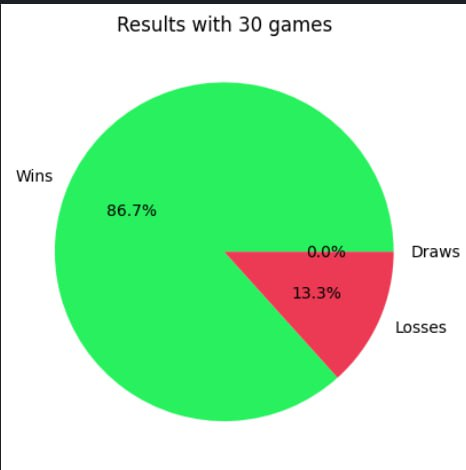
   
   - depth = 2 W=1, L=-1, 10 games, for an intermediate node we have a heuristic function called longest_sequence and its returned value is normalized in order to have a value between -0.5 and +0.5 
      - 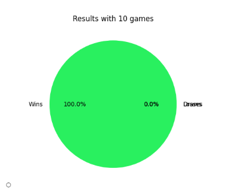
        
   - depth = 3 W=1, L=-1, 30 games, for an intermediate node we have a heuristic function called longest_sequence and its returned value is normalized in order to have a value between -0.5 and +0.5
      - 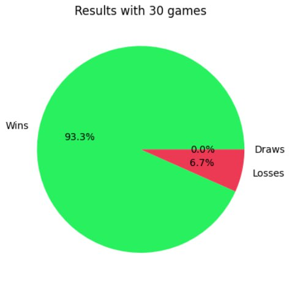
   
   - depth = 2 W=1, L=-1, 5 games,ONE random game to decide the value of an intermediate node (3h around on Colab)
      - 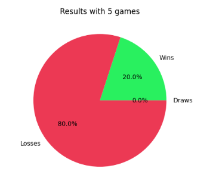
   
   
- ***Time for each move***
   
   | Depth                            | Time for each move (maximum values)                 |
   | -------------------------------- | ---------------------- |
   | 1                                | 0.139 s                |
   | 2                                | 4.398 s                |
   | 3                                | 186.110 s              |
   

### AlphaBetaPrunuing
The code in the file Alpha_beta_pruning_quixo.ipynb is just an implementation of the MinMax algorithm but faster. It does not chnge the nature of the algorithm itself. The base idea is that one of __Pat Winston__ : "If you have an idea that is surely bad, don't take the time to see how trurly awful it is".
Thus, instead of exploring the whole tree, this algorithm cuts off some branches if some conditions are satisfied. In particular it checks the values of two variables, alpha and beta: if one of them is higher or equal to the other the branch is cut. In this manner it is possible to proceed quickly in the exploration. As in the minimax approach, we recur to _minimax()_ function that presents the updating of some variables at the end of each maximization/minimization stage. On one hand during the maximization stage: best_score=max(score, best_score) and  alpha = max(alpha, score). On the other hand, in minimization stage: best_score = min(score, best_score), beta=min(beta, score)).Then there is a condition that checks if that branch has to be cut off or less (if beta <= alpha: break). 
Also in this case it is possible to establish a depth where end our exploration.

**Other usefull methods in MyGame Class**

**Results**

- ***Winning percentages***
      
   - depth = 1 W=1, L=-1, 30 games, for an intermediate node we have a heuristic function called longest_sequence and its returned value is normalized in order to have a value between -0.5 and +0.5 
    - 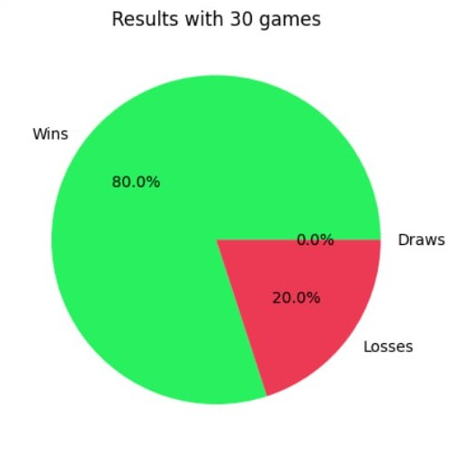
   
   - depth = 2 W=1, L=-1, 30 games, for an intermediate node we have a heuristic function called longest_sequence and its returned value is normalized in order to have a value between -0.5 and +0.5
     - 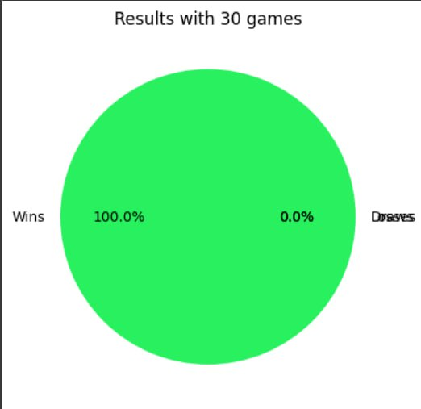
   
   - depth = 3 W=1, L=-1, 30 games, for an intermediate node we have a heuristic function called longest_sequence and its returned value is normalized in order to have a value between -0.5 and +0.5
     - 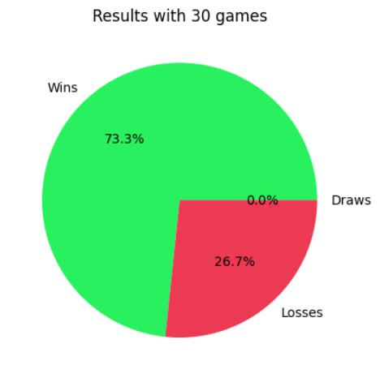
   
   - depth = 4 W=1, L=-1, 30 games, for an intermediate node we have a heuristic function called longest_sequence and its returned value is normalized in order to have a value between -0.5 and +0.5
     - 
   
   - depth = 4 W=1, L=-1, 9 games, for an intermediate node we have a heuristic function called longest_sequence and its returned value is normalized in order to have a value between -0.5 and +0.5 (around 25m)
     - 9 wins -> 100% win 

- ***Time for each move***
   
   | Depth                            | Time for each move (maximum values)                 |
   | -------------------------------- | ---------------------- |
   | 1                                | 0.233 s                |
   | 2                                | 2.09 s                 |
   | 3                                | 15.244 s               |
   | 4                                | 111.433 s              |
   | 5                                | 469.711 s              |
   

### MonteCarlo RL
The code in the file Quixo_MonteCarlo.ipynb it is possible to find a RL Agent that learns with a MonteCarlo approach.
The Monte Carlo method for reinforcement learning is an episodic learning algorithm that learns directly from episodes without any prior knowledge. It is used for estimating the value of states.
We implemented a random game and kept track of all the states. Then we evaluate them using the following expression: 

value_dict[state] = value_dict[state] + epsilon * (final_reward - svalue_dict[state] 

where the final_reward is the final state rating. If our player wins, he will receive a positive reward(**reinforcement**) otherwise a negative reward. The idea is therefore to build a dictionary of states with relative evaluation that then the the agent can follow to make dicisions. 
In particular the functions implemented are: 

**Other usefull methods in MyGame Class**
- `get_rotations(self)`
  - this function generate rotations of a game board
    
- `get_symmetries(self)`
  - it calculate all the possible symmetries of the board
 
- To keep the q table, we use a dictionary. For that we implement the `__hash__` and `__eq__` functions for the `MyGame` function so we can use those objects as part of the key. Additionally, we also use these functions to match elements that are symetries/rotations of the original board, for efficiency.
**Results**

- EPISODES_TRAINING = 200k, 100 games, Montecarlo Player as firt
  -

- EPISODES_TRAINING = 200k, 100 games, Montecarlo Player as second
  -

### Q-Learning

- For the Model-Free Q-Learning agent (`QPlayer`, found in `QLearning.ipynb`) we implemented an agent that learns to play the game by performing actions chosen through a epsilon-greedy stategy and is rewarded for each of them, allowing for it to later choose the actions that will lead to the best reward for each state in a game.

- For each action it performs, the q-table is updated using the formula $Q(s_t, a_t) \leftarrow (1 - \alpha) * Q(s_t, a_t) + \alpha * (r + \gamma * max_a(s_{t+1}, a_{t + 1}))$.
  
- As quixo is a two-player game, we need to simulate the opponent's moves as part of the environment, and, only then, update the table. To approach that, we consider the start of the agent's turn to be $s_t$, which transitions to state $s_{t+1}$ after the agent's action. Then, we simmulate the opponent's action, transitioning to state $s_{t + 2}$, where we finally update the table in respect to $s_t$.

- Our reward function is defined as follows:

| Condition                            | Reward                 |
| ------------------------------------ | ---------------------- |
| Play a winning move                  | +1                     |
| Play a loosing move                  | -1                     |
| Increase own biggest sequence        | + 0.25 * size of board |
| Decrease own biggest sequence        | - 0.25 * size of board |
| Icrease opponent's biggest sequence  | - 0.25 * size of board |
| Decrease opponent's biggest sequence | + 0.25 * size of board |

**Other usefull methods in MyGame Class**

- To keep the q table, we use a dictionary. For that we implement the `__hash__` and `__eq__` functions for the `MyGame` function so we can use those objects as part of the key.

**Results**

- EPISODES_TRAINING = 500k, 100 games
  - 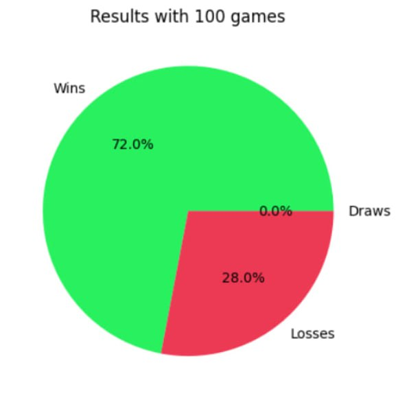

###  ES 1+λ
The code in the file Quixo_ES.ipynb
The Evolutionary Strategy is an approach that allows to select the individual that performs better in a specific task. In our case we are looking to the best one that plays well the match against Random Player. We adopted a (1+λ)-ES that in each epoch generates λ offspring from a parent and that evaluates all of them with a fitness function. How does our agent work? It has a list of rule-action couples, each of one has a weight that represents a probability.
The list of rule-action couples is the following, where some couples are more specific than others:
- r1-a1: if there is a row without a cube with agent's face, then it pushes the cube there (it is a guarantee that on every row there is at least one agent's cube)
- r2-a2: if there is a column without a cube with agent's face, then it pushes the cube there (it is a guarantee that on every column there is at least one agent's cube)
- r3-a3: 
...
- r14-a14:
Every individual has a set of these couples with an associated weight just passing the list of weights to the set_dictionary() method that returns the rule-action-weight triplets.
During a match (for both training and testing) it selects the couples of rule-action that satisfy a certain situation (with test_conditions() method) and it picks one according to a weighted roulette-wheel selection, returned by voting() method. At training time adaptive() method is called to play a match with the individual, while at test time make_move() is called to do the same.
The first called function is ES_1_plus_lambda() that for a certain number of epochs (EPISODES_TRAINING) it generates individuals (by perturbing the weights of the best solution with a Gaussian density function) and compare them to get the best. At every epoch the fitness() function is called in order to evaluate the individual passed as argument: it plays for a certain number of matches (EPISODES_TRAINING_FITNESS) against the Random player and it is evaluated by the percentage of wins on the number of games.
There is a steady-state condition for which, if a better solution is not found, it skips the search of new individuals and take as good the last best individual.

We have tested the ES player training it with several configurations. Many of these tests are against Random player changing some parameters like the number of episodes, epochs, individuals or exploration rate. A few tests were conducted training the agent against the Alpha-Beta player and we found that, even if it was trained for 2 epochs, it performs well against the Random player because it was trained with an more expert agent than Random agent.

**usefull methods**

**Results**

- PLAYER 1
     
  

   - EPISODES_TRAINING = 45, EPISODES_TRAINING_FITNESS = 35, EPISODES_GAME = 100, NUMBER_OF_RULES = 8 (commented 1,2, 10,11,12,13), LAMBDA = 17, INITIAL SIGMA = 0.2 , FINAL_SIGMA = 0.02, training against random, initialweights small random as the configuration of the final code:
   - 
     - Best_fitness =  0.6571428571428571
     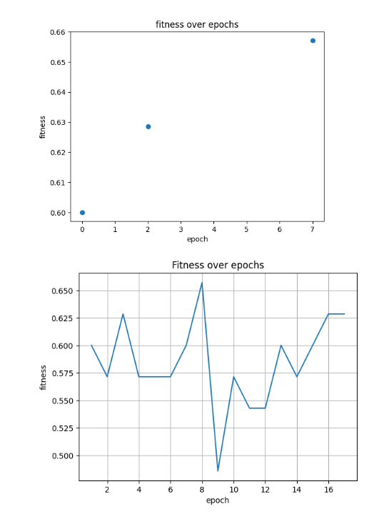

     - ES agent wins = 42%
     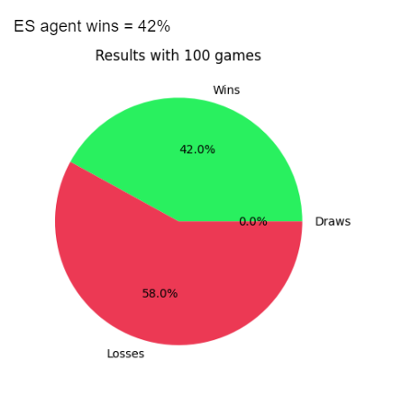

   - EPISODES_TRAINING = 110, EPISODES_TRAINING_FITNESS = 40, EPISODES_GAME = 100, NUMBER_OF_RULES = 8 (commented 1,2, 10,11,12,13), LAMBDA = 20, INITIAL SIGMA = 0.35 , FINAL_SIGMA = 0.02, training against random, initialweights small random as the configuration of the final code:

   - Best_fitness =  0.675
   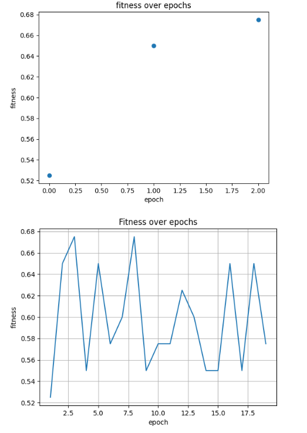
   
   - ES agent wins = from 41% to 48% 
   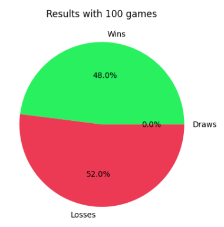

   - EPISODES_TRAINING = 60, EPISODES_TRAINING_FITNESS = 60, EPISODES_GAME = 100, NUMBER_OF_RULES = 9 (commented 2, 10,11,12,13), LAMBDA = 20, INITIAL SIGMA = 0.35 , FINAL_SIGMA = 0.02, training against random, initialweights small random as the configuration of the final code:

   - Best_fitness =  0.8166666666666667
   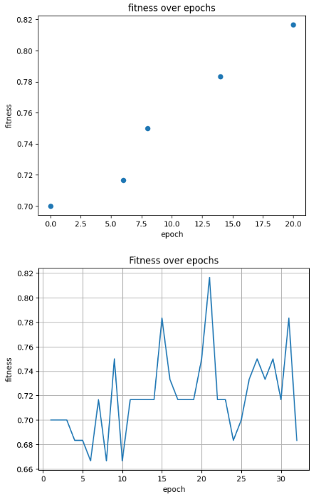
   
   - ES agent wins =  from 57%  to 61%
   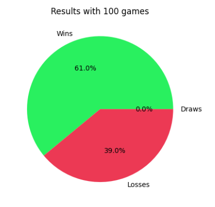

   - EPISODES_TRAINING = 60, EPISODES_TRAINING_FITNESS = 70, EPISODES_GAME = 100, NUMBER_OF_RULES = 10 (commented 10,11,12,13), LAMBDA = 20, INITIAL SIGMA = 0.35 , FINAL_SIGMA = 0.05, training against random, initialweights small random as the configuration of the final code:

     - Best_fitness =  0.8571428571428571
     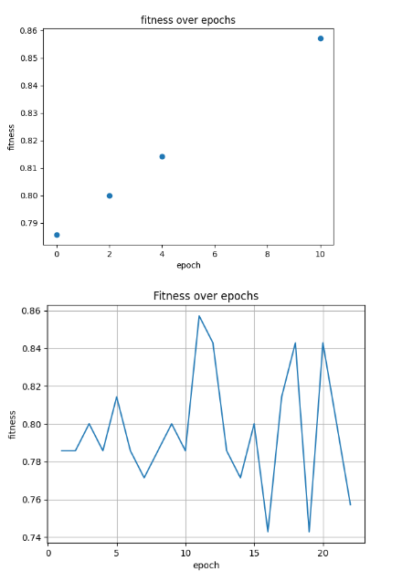

     - ES agent wins =  69%
     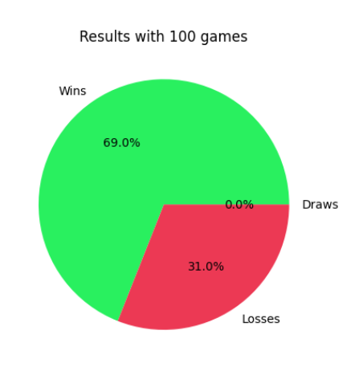

    - EPISODES_TRAINING = 70, EPISODES_TRAINING_FITNESS = 80, EPISODES_GAME = 100, NUMBER_OF_RULES = 14, LAMBDA = 20, INITIAL SIGMA = 0.35 , FINAL_SIGMA = 0.08, training against random, initialweights small random as the configuration of the final code:

      - Best_fitness =  0.9625
      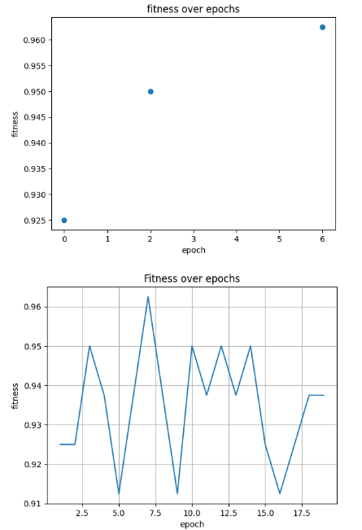

      - ES agent wins =  94%
      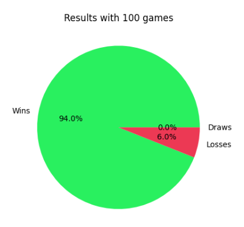

