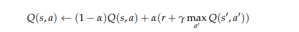
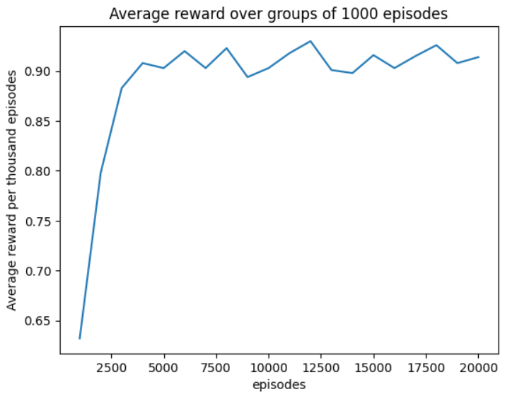

# LAB 10
## Matteo Pietro Pillitteri s314404 Polytechnic of Turin

### Brief introduction
- The code lab10.ipynb in the repository "lab10" implements  Q-learning algorithm that learns the best move to apply in each turn in the game of Tic Tac Toe
See below for more details.
- The  tic_tac_toe_training_debug.zip contains a log file that shows some details of my training <br>
  ([Learn more on the logging facility for Python here!](https://docs.python.org/3/library/logging.html))
> [!IMPORTANT]
> I worked alone for this lab, I did my best and I am grateful to receive advice to improve the solution and learn more.
> By the way, it was very helpful to confront [Rita](https://github.com/class1c-j/polito-ci-labs/tree/main) to understand the difficulties involved in interpreting Q(St+1, a) in the context of a game in which 2 players take part

### The steps that led me to a solution:

- Study the proposed Montecarlo Approach to learn a game strategy in Tic Tac Toe: https://github.com/squillero/computational-intelligence/blob/master/2023-24/lab10-gx.ipynb
   
- Evaluate possible ways to optimize the policy in a Markov Decision Process: Montecarlo, Q-Learning, DQN (Deep Q-Networks) etc..

- Understand the logic behind Q-learning. Key points:
   - The goal is to figure out the optimal (smartest possible) policy
   - The agent stores a **Q-Table**: a function Q(s,a) over every possible state "s" and action "a" that could be performed in that state
   - The agent performs an action "a" in a given state "s" and it will then transition to another state s'. It also receives a reward R(s, a) as a result.
   - A **model-free** learning algorithm: it is an algorithm that learns directly from interacting with the environment without having an explicit representation of the environment's model.
   - The **Q-Table** is updated as: <br>
     
       
- Implementation details:
  - The TicTacToeEnvironment class contains everything you need to start a new game, manage player switching, detect a win, apply a new action and return rewards.
  - As you can see from the formula of Q learning it is important to make an estimate of the maximum value obtainable from the state St+1. In a context where two players alternate, it becomes difficult to consider the St+1 status. <br>
    In my code, before to upload the Q-table for a specific state and action, with the lines:
    ```python
     outcomes_from_future = env.evaluate_possible_outcome(new_state)
     Q_S_t_next = 0 if not outcomes_from_future else outcomes_from_future
    ```
   
      I’m saying that for example if X is in x={3, 7} or ={8, 5} and it chooses 1 as the action, the situation will be: <br>
      - available: [2, 6, 9, 1, 4] <br>
      - current:  State(x={3, 7}, o={8, 5}) <br>
      - info: {'The player: X ,does action: 1'} <br>
      - reward:  0 <br>
      - new:  State(x={1, 3, 7}, o={8, 5}) <br>
      - possible_outcomes:  [{8, 2, 5}, {8, 5, 6}, {8, 9, 5}, {8, 4, 5}] <br>
      - possible_outcomes_values:  [1, 0, 0, 0] <br>
      
      this means that if in the next state "O" chooses 5 as an action, it will win. So what I do is penalize X’s choice to choose action 1 in the state x={3, 7}  o={8, 5} 
  
  
- Exploration vs exploitation:
  - If we use always the best action a that we’vediscovered so far, Q-learning is 100% exploitative. With a **ε-greedy** approach that balances exploration of the environment (i.e., trying out new moves) with exploitation of current knowledge the algorithm can avoid getting stuck in suboptimal local minima.
  - At the beginning the exploration rate Epsilon is setted to 1. As the agent learns more about the environment, epsilon will decay by some rate.
  - To determine wheter the agent will choose exploration or exploitation at each time step, a random number between 0 and 1 is generated. If tis number is greater than epsilon the agent will choose its next action via exploitation choosing the action with the highest Q-value for its current state. 

- Other parameters:
     - learning rate: The parameter α determines the "speed" at which the agent updates Q based on new information.
     - discount rate: The discount rate determines how much value to give to future rewards versus immediate rewards. A value close to 1 implies that the agent gives a lot of weight to future rewards, while a value close to 0 indicates that the agent mainly considers immediate rewards.
   
 
### Some results:
>[!NOTE]

- Training over 20_000 episodes: <br>   

- Test over 50_000 episodes in which: X = Q_learning agent ; O r= random player:
  - Q-learning agent wins 90.7%
  - Random player wins: 2.76%
  - Drawn: 6.54%
 
- Gameplay: Q-learning agent (X) vs Random (O) <br>
  
  
 
### Useful reads:
- Essentials of Metaheuristics, Sean Luke, Second Edition V 2.3, Chapter 10.1.1 Q-Learning
- Reinforcement Learning, Richard S.Sutton & Andrew G. Bardo, Second Edition, Chapter 6.5 Q-Learning: Off-policy TD Control
  
