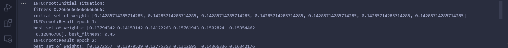
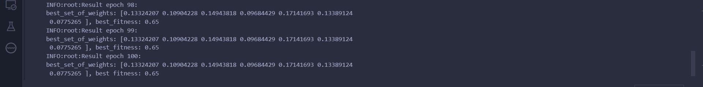
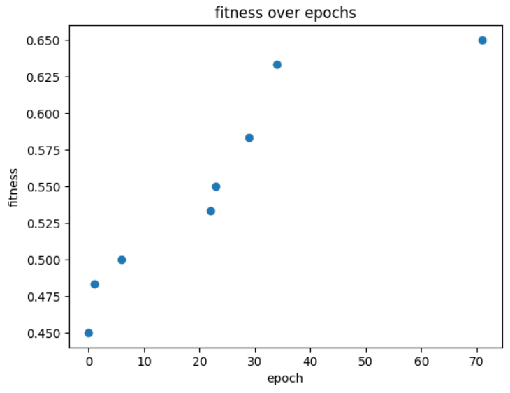
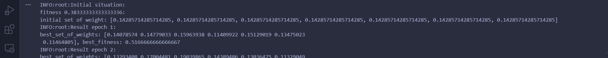
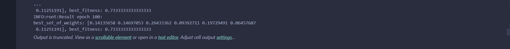
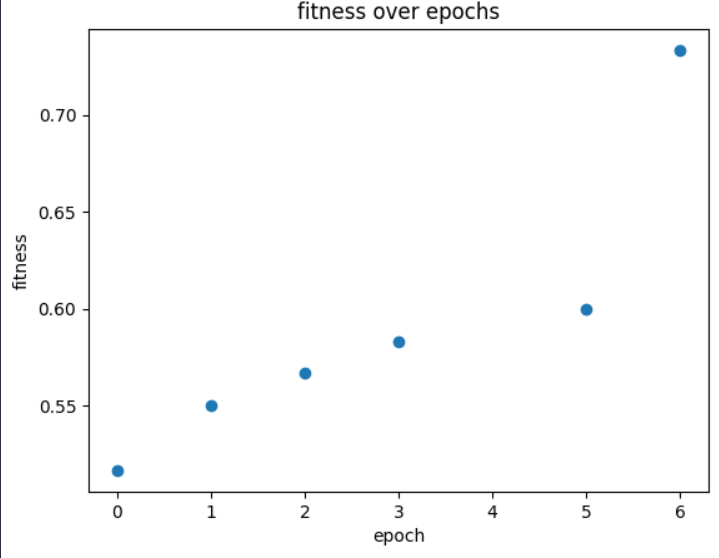
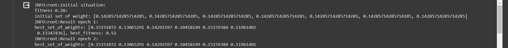
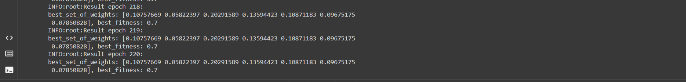
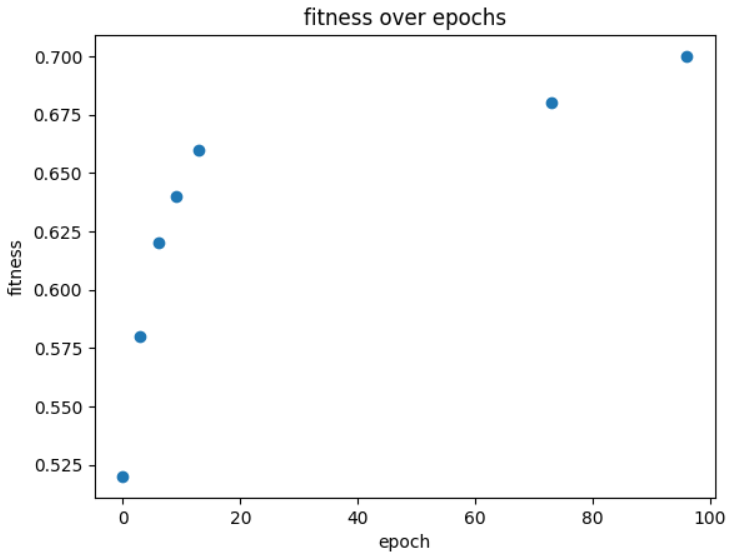

# LAB 02 NIM-ES
## Matteo Pietro Pillitteri s314404 Polytechnic of Turin

### Brief introduction
The code in the repository "lab2" implements an Adaptive (1+λ)-ES that has the goal to tune a set of weights. The tuning is useful in order to develop a game strategy that uses a fixed set of rules each used with probability proportional to these weights. See below for more details.
> [!IMPORTANT]
> I worked alone for this lab, I did my best and I am grateful to receive advice to improve the solution and learn more.

### The steps that led me to a solution:
- Understand the problem: i saw a lot of materials about the NIM GAME and its verions. I became familiar with the nim-sum in order to understand the "optimal strategy". In particular, the goal of the game is to leave the opponent to take the last "object" and to win, nim sum shall always be != 0. The last one to take loses the game. Some references:
   - https://en.wikipedia.org/wiki/Nim
   - https://www.youtube.com/watch?v=UdmkJeI8xIk
- Understand ESs: After having theoretically learned the theory on evolution strategies, I understood the implementation logic of algorithms based on the plus strategy.
  - The code of Squillero: https://github.com/squillero/computational-intelligence/blob/master/2023-24/rastrigin.ipynb helped me a lot!
  - Useful read:  Essentials of Metaheuristics, A Set of Undergraduate Lecture Notes by Sean Luke (Second Edition), chapter 3.1
- Start to code: first of all i designed a set of rules and a set of actions. Each rule returns True or False depending on whether the condition is satisfied or not. I assigned one action to one rule and then i try if the algorithm was able to play against other strategies:
  - a set of games is composed by 100 games. Player 1 plays always with my strategy (called adaptive) while Player0 plays with different strategy. In particular, Player0 changes the strategy for each 20 games. In the half of the set of games, the opponent will always play with the optimal strategy (based on nim sum). This variety will help the tuning in the next steps.
  - each game keeps track about the winner with a simple counter
  - At the end, the fitness will be: number of games in which player1 is the winner/total number of games
- Chose the action: several rules at the same time could be active. It means that different conditions could return True when they are evaluated by the **test_condition** function. So, how I chose the action to apply?
   - the **voting(list_of_actions)** function implements a sort of roulette wheel selection of the action to apply. It receives a list composed by tuples (action, weight). As it is possible to see in the next steps, the weights can have a value higher than one. I wanted to use the weights as probability but only in the __action selection__. So, the weights are normalized and a random floating point number is generated and the action with the highest score will have a greater chance of being selected.
   - useful read: https://stackoverflow.com/questions/44430194/roulette-wheel-selection-with-positive-and-negative-fitness-values-for-minimizat
- (1+λ)-ES: an individual is a fixed lenght list of weights. The first individual is initialized with elements with the same value. In particular the initial weights are: 1/len(CONDITIONS), so if there are seven rules, the initial individual which represents the initial solution (and the best one) will be an array of 7 elements of value 0,14285714285714285.  With this configuration, As the test at the bottom of the .ipynb shown that it is possible to obtain a fitness in the range between 0.27 and 0.41. For each epoch lambda new individuals are generated by applying a normal distribution to the current solution. The generated individuals can not have values smaller than 0.01 (clip). Each new individual is evaluated with its fitness. If there is an individual that has a fitness greater than the current best, it will become the new best. At the next epoch the normal distribution will be applied on the new best in order to move around the current best to maximize the fitness
> [!NOTE]
> The fitness fluctuates for each set of game using the same set of weights because player 0 plays with different strategies. Some moves are chosen randomly by both the opponent and my player (Player1) without any particular strategy. What matters is that with initial setting of the weights and the sets of rules that describe the strategy called "adaptive", large fitness values are not obtained. The goal of the code is to show that by tuning the weights from low values of the fitness it is possible to reach high values

- Exploration vs exploitation: to be honest, the most difficult thing was to tune λ and the mutation step σ. Manually i tried different values of σ for obtaining an improvment. At the beginning i kept it constant but I found the best results with an **adaptive** approach. So I decided to favor exploration by using an higher value of sigma at the beginning. This allowed the algorithm to explore more in the space.
Progressively with the passing of the eras and therefore of the generations, the mutation steps decrease according to the formula: "σ=max(final_σ,initial_σ−(initial_σ−final_σ)×(epoch/ NUM_EPOCHS))". This formula ensures that σ does not fall below the final set value. Thus, as the sigma decreases, exploitation is favored.

### Trick:
Remember that in the nim game the nim sum shall always be != 0 for a winner move. My last rule checks if there are moves that bring to a nim sum == 0 and if this rule is selected, the associated action (notoptimal_move) return a move that brings to a nim sum == 0. It is possible to see over the epochs that the weight associated with this last rule is increasingly lower

#Some results:
> [!NOTE]
> The settings shown below are just some of several parameter settings I tried. The last two days of work were exclusively on parameter tuning. Suggestions on how to best manage variance are very welcome
- Setting1:
   - NUM_EPOCHS = 100 
   - NUM_GAMES = 60 
   - GAME_ROWS = 5
   - λ = 30
   - initial_σ = 0.012
   - final_σ = 0.001
   - σ = initial_σ
   - result:
     
     
     
- Setting2:
   - NUM_EPOCH = 100
   - NUM_GAMES = 60
   - GAME_ROWS = 5
   - λ = 30
   - initial_σ = 0.017
   - final_σ = 0.01
   - σ = initial_σ
   - result:
     
     
     
- Setting3:
   - NUM_EPOCH = 220
   - NUM_GAMES = 50
   - GAME_ROWS = 5
   - λ = 13
   - initial_σ = 0.017
   - final_σ = 0.012
   - σ = initial_σ
   - result:
     
     
     
- Setting4:
   - NUM_EPOCH = 200
   - NUM_GAMES = 50
   - GAME_ROWS = 5
   - λ = 9
   - initial_σ = 0.018
   - final_σ = 0.015
   - σ = initial_σ
   - result:
     
     
     

### Other materials:
- https://numpy.org/doc/stable/reference/generated/numpy.clip.html
- https://www.geeksforgeeks.org/graph-plotting-in-python-set-1/
- https://www.programiz.com/python-programming/methods/built-in/zip

