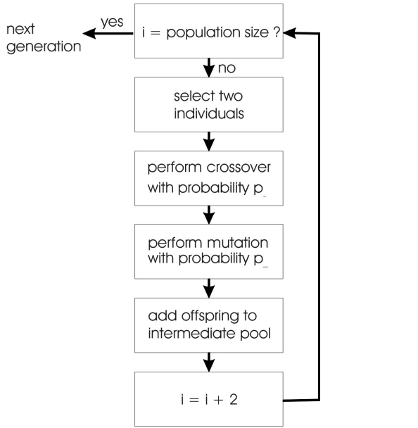
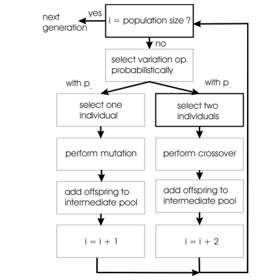
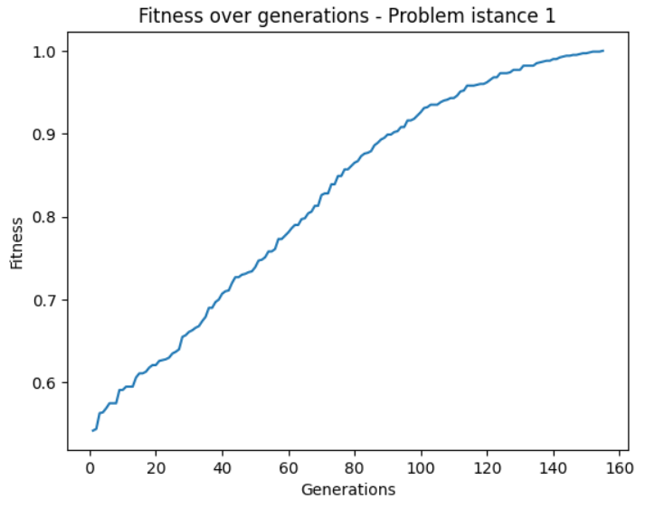
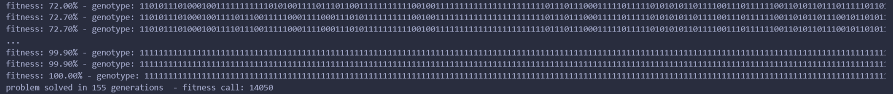
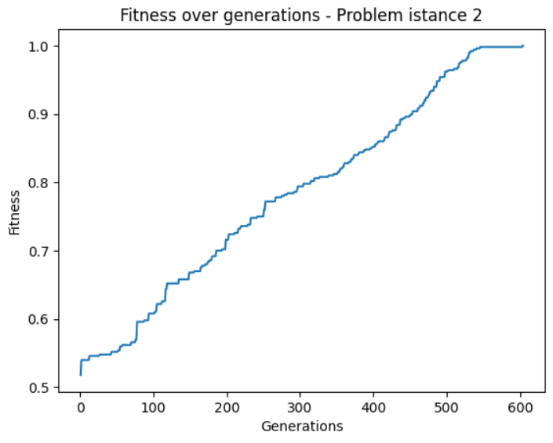
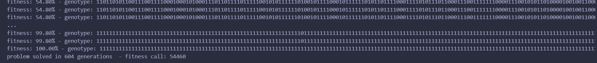
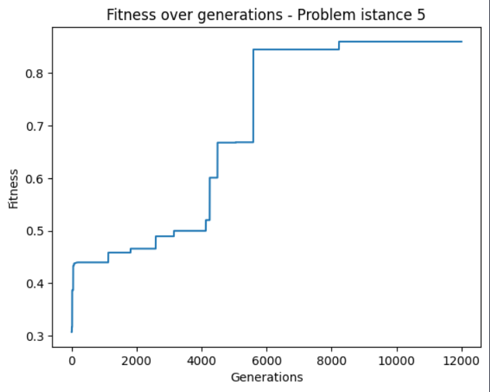
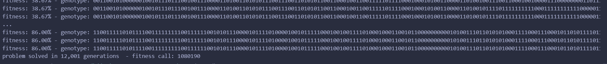
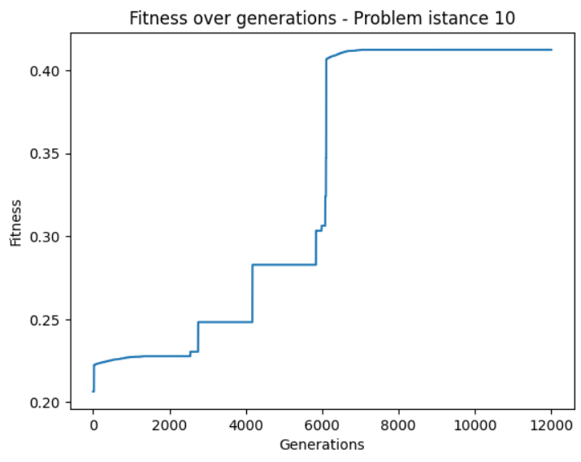
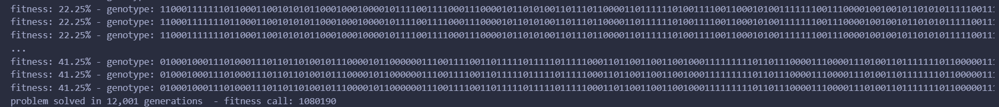

# LAB 09
## Matteo Pietro Pillitteri s314404 Polytechnic of Turin

### Brief introduction
The code in the repository "lab9" implements a Generational GA + Elitism that has the goal solve the *Problem* instances 1, 2, 5, and 10 on a 1000-loci genomes, using a minimum number of fitness calls. 
See below for more details.
> [!IMPORTANT]
> I worked alone for this lab, I did my best and I am grateful to receive advice to improve the solution and learn more.

### The steps that led me to a solution:

- **You must understand that there is nothing to understand about the problem generator**: it very important to understand that the make_problem function is a blackbox that provide you the fitness metric to evaluate your individuals. Everything you need to take the first steps into the problem:
   - the individual's genome is encoded as a bit string
   - choose the strategy
   
- Explore the possibilities: I choosed to work with Genetic algorithm (GA)  After having theoretically learned the theory on GA, I understood the implementation logic and i tried different kind of GA. There are two main approaches:
  - Recombination + Mutation:
     - 
  - Recombination vs Mutation:
     - 
       
  Modern GA algorithms are based on  this second strategy using crossover or mutation according to some probability. Here you can find a basic implementation based on this approach: https://github.com/squillero/computational-intelligence/blob/master/2023-24/set-covering_ea.ipynb
    
- Start to code: as I said, I tried several strategies such as: Steady state GA, Generational GA, **Generetional GA + Elitism** and some GA variants like the Islands Model
  - I found Generational GA + Elitism the best one in optimizing fitness and minimizing fitness calls:
    - Generational: in a Generational GA in each generation a new population is created by selecting the parents and then applying genetic operatiors. The new generation of individuals replaces the old generation completely. 
    - Elitism: is a strategy used in GA for preserving the best individuals from one generation to the next. Hence, a certain number of the best performing individuals from the current generation are directly copied in the next generation without any change
  
  - Parameter tuning: As always, when working with Evolutionary algorithms, the choice of parameters is difficult. I tried many values for population size, tournament size and mutation probability and after several attempts I found that the best configuration for the basic parameters of my algorithm is the following:
    - POPULATION_SIZE = 100
    -  TOURNAMENT_SIZE = 2
    - MUTATION_PROBABILITY = 0.10

- Exploration vs exploitation: the the percentage by which mutation or recombination is chosen in a Genetic Algorithm plays a crucial role in balancing the exploration and exploitation of the solution space. Exploration refers to the ability to discover new regions of the solution space, while exploitation concerns the refinement of existing solutions.
**Dynamic adaptation** of the mutation rate can be useful. Generally speaking:
  - A higher mutation rate promotes exploitation: mutation operator is tweaking a solution so it does exploitation. 
  - A lower mutation rate favors exploration: crossover operator allow you to jump in a different place so it doeas exploration
  
In my algorithm I chose to increase the mutation rate by 0.01 every time for 50 consecutive generations there is no improvement in terms of fitness up to a maximum of 30%. If the mutation rate has been increased at least once, when an improvement in fitness is obtained the mutation rate is decremented to bring it back to the base value of 10%. 
This way when the solution converges, the algorithm tries to refine it by "looking" around the best solution
    
- **Diversity is all you need**: If you have different individuals with the same traits and you mix the traits you end up with something that has the same traits, so recombination in this case doesn’t work. If all the individuals are similar they are not able to create differences anymore. In brief, If there are not enough differences, recombination doesn’t work! 
Using a variety of mutation operators can help improve diverity. For example, you can have mutations that introduce small variations, as well as more aggressive mutations. At an certain point In the population there are a lot of clones of the same individual and the only way to increase the diversity and keep on evoling in this situation is adding something new by the mutation becouse with the crossover if we swap to identical individual you get an identical individual.
for this reason I implemented different types of mutation:
   - bit flip (it is called "mutation" in my code)
   - swap mutation
   - gaussian mutation
   - reverse mutation
   - random resetting
   - scramble mutation
  
   At first I tried to use these types of mutations randomly to promote greater diversity. In the final solution of my algorithm I use 4 in a more stable way. Anyway I left all the mutation operators implemented in a specific section of my code so that you can use them in your algorithm.
   I implemented also different kind of crossover: one-cut, two-cut, n-point-crossover, uniform-crossover. In the final version of my code I use two-cut and one-cut. 
   
   In my code it is possible to see that i use this two lists:
     - mut = [mutation, swap_mutation, reverse_mutation, scramble_mutation]
     - crossover = [two_cut_xover, one_cut_xover]
       
   During the generation of the new population I select from time to time different operators as you can see in the code.

### Some results:
> [!NOTE]
> Trying my code you might get different results from the ones below. This depends on several factors:
> - initial population
> - At each generation the number of mutations or recombinations applied
> - probabilities by which different mutation or recombination operators are selected 
> Anyway the results do not vary much with each run of the algorithm with the same values for the parameters of POPULATION SIZE, MUTATION PROBABILITY, TOURNAMENT SIZE

- Problem instance 1 (100% fitness - 14050 fitness calls):
     - 
     - 
  
- Problem instance 2 (100% fitness - 54460 fitness calls):
     - 
     - 
  
- Problem instance 5: (86% fitness - 1080190 fitness calls):
     - 
     - 
  
- Problem instance 10: (41.25% fitness - 1080190 fitness calls):
     - 
     - 
 
### Useful reads:
   - Essentials of Metaheuristics, Sean Luke, Second Edition - Chapters 3.2, 3.3
   - https://www.geeksforgeeks.org/mutation-algorithms-for-string-manipulation-ga/
   - https://medium.com/@samiran.bera/crossover-operator-the-heart-of-genetic-algorithm-6c0fdcb405c0
